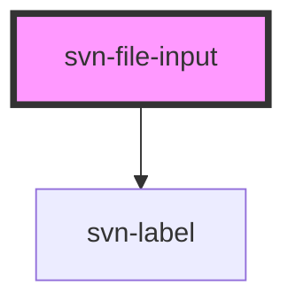

## Component example

<script type="module" src="https://unpkg.com/@nclemen/seven-core@latest/dist/seven-core/seven-core.esm.js"></script>

### default:

```html
<svn-file-input el-id="fileinputone" file-type="image"></svn-file-input>
```

<svn-file-input el-id="fileinputone" file-type="image"></svn-file-input>

### multiple file select:

To select multiple files hold down **ctrl** on windows or **command** on macos.

```html
<svn-file-input multiple el-id="fileinputtwo" file-type="image"></svn-file-input>
```

<svn-file-input multiple el-id="fileinputtwo" file-type="image"></svn-file-input>

<!-- Auto Generated Below -->


## Properties

| Property                | Attribute   | Description                                 | Type      | Default     |
| ----------------------- | ----------- | ------------------------------------------- | --------- | ----------- |
| `elId` _(required)_     | `el-id`     | the id of the component element             | `string`  | `undefined` |
| `fileType` _(required)_ | `file-type` | the type of file that can be uploaded       | `string`  | `undefined` |
| `lblText`               | `lbl-text`  | the text for the label                      | `string`  | `undefined` |
| `multiple`              | `multiple`  | set to true to turn on multiple file select | `boolean` | `false`     |


## Dependencies

### Depends on

- [svn-label](../svn-label)

### Graph


----------------------------------------------

*Built with [StencilJS](https://stenciljs.com/)*
