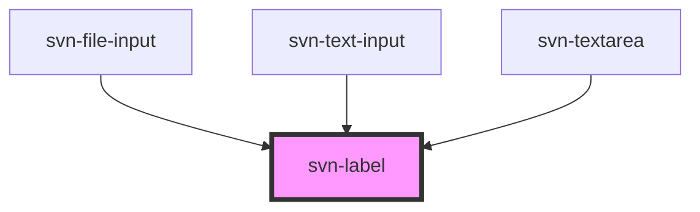

<!-- Auto Generated Below -->

## Properties

| Property             | Attribute | Description                                     | Type     | Default     |
| -------------------- | --------- | ----------------------------------------------- | -------- | ----------- |
| `owner` _(required)_ | `owner`   | the id of the element that the label belongs to | `string` | `undefined` |
| `text`               | `text`    | the text displayed by the label                 | `string` | `undefined` |

## Dependencies

### Used by

 - [svn-file-input](../svn-file-input)
 - [svn-text-input](../svn-text-input)
 - [svn-textarea](../svn-textarea)

### Graph

----------------------------------------------

*Built with [StencilJS](https://stenciljs.com/)*
