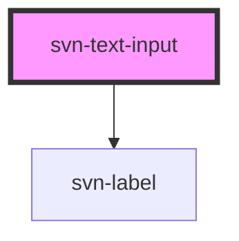

## Component example

<script type="module" src="https://unpkg.com/@nclemen/seven-core@0.0.31/dist/seven-core/seven-core.esm.js"></script>


```html
<svn-text-input></svn-text-input>
```

the code example above will result into this:

<svn-text-input></svn-text-input>

```html
<svn-text-input center></svn-text-input>
```

the code example above will result into this:

<svn-text-input center></svn-text-input>

```html
<svn-text-input placeholder="enter your name here..."></svn-text-input>
```

the code example above will result into this:

<svn-text-input placeholder="enter your name here..."></svn-text-input>

<!-- Auto Generated Below -->


## Properties

| Property            | Attribute      | Description                                                                        | Type      | Default     |
| ------------------- | -------------- | ---------------------------------------------------------------------------------- | --------- | ----------- |
| `autocomplete`      | `autocomplete` | prop to determine whether or not the autocomplete is turned on for the input field | `boolean` | `false`     |
| `center`            | `center`       | prop to determine whether or not the text is put in the center of the input        | `boolean` | `false`     |
| `disabled`          | `disabled`     | prop to determine whether or not the input field is disabled or not                | `boolean` | `false`     |
| `elId` _(required)_ | `el-id`        | the id of the input element                                                        | `string`  | `undefined` |
| `lblText`           | `lbl-text`     | the text for the label                                                             | `string`  | `undefined` |
| `name` _(required)_ | `name`         | the name attribute of the element                                                  | `string`  | `undefined` |
| `placeholder`       | `placeholder`  | the placeholder for the text input                                                 | `string`  | `undefined` |
| `value`             | `value`        | the value of the input field                                                       | `string`  | `undefined` |


## Dependencies

### Depends on

- [svn-label](../svn-label)

### Graph


----------------------------------------------

*Built with [StencilJS](https://stenciljs.com/)*
