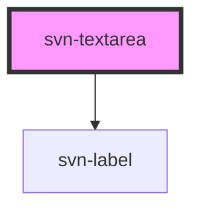

## Component example

<script type="module" src="https://unpkg.com/@nclemen/seven-core@0.0.31/dist/seven-core/seven-core.esm.js"></script>


```html
<svn-textarea el-id="texttwo" resizeDisable="true" minlength="2" maxlength="10" placeholder="enter your message..."></svn-textarea>
```

the code example above will result into this:

<svn-textarea el-id="texttwo" resizeDisable="true" minlength="2" maxlength="10" placeholder="enter your message..."></svn-textarea>

<!-- Auto Generated Below -->


## Properties

| Property            | Attribute        | Description                                                                                                              | Type      | Default     |
| ------------------- | ---------------- | ------------------------------------------------------------------------------------------------------------------------ | --------- | ----------- |
| `autocapitalize`    | `autocapitalize` | turn on automatic capitalization                                                                                         | `string`  | `undefined` |
| `autocorrect`       | `autocorrect`    | set to on to turn on autocorrect(is turned off by default)                                                               | `string`  | `"off"`     |
| `cols`              | `cols`           | the columns for the text area element                                                                                    | `number`  | `undefined` |
| `disabled`          | `disabled`       | set to true to disable input for textarea (default = false)                                                              | `boolean` | `false`     |
| `elId` _(required)_ | `el-id`          | the id of the textarea                                                                                                   | `string`  | `undefined` |
| `focusTarget`       | `focus`          | set to true to automatically focus on the text area when page is loaded (disabled by default)                            | `boolean` | `false`     |
| `form`              | `form`           | the form which the text area belongs to                                                                                  | `string`  | `undefined` |
| `maxlength`         | `maxlength`      | the maximum amount of characters for textarea                                                                            | `number`  | `undefined` |
| `minlength`         | `minlength`      | the mininmal amount of character for textarea                                                                            | `number`  | `undefined` |
| `name`              | `name`           | the name attribute for textarea                                                                                          | `string`  | `undefined` |
| `placeholder`       | `placeholder`    | a placeholder for the textarea                                                                                           | `string`  | `undefined` |
| `readonly`          | `readonly`       | set to true to turn on read only (this does not prevent the users from clicking or selecting in the control)             | `string`  | `undefined` |
| `required`          | `required`       | set to true if text area is a required field in forms                                                                    | `boolean` | `undefined` |
| `resizeDisable`     | `resize-disable` | attribute to enable or disable resize                                                                                    | `boolean` | `false`     |
| `rows`              | `rows`           | the row for the textarea element                                                                                         | `number`  | `5`         |
| `spell`             | `spell`          | set to true to turn on spellcheck, to false to turn off spellcheck and default to use the default setting for spellcheck | `any`     | `undefined` |
| `wrap`              | `wrap`           | set to hard, soft or off                                                                                                 | `string`  | `undefined` |


## Dependencies

### Depends on

- [svn-label](../svn-label)

### Graph


----------------------------------------------

*Built with [StencilJS](https://stenciljs.com/)*
